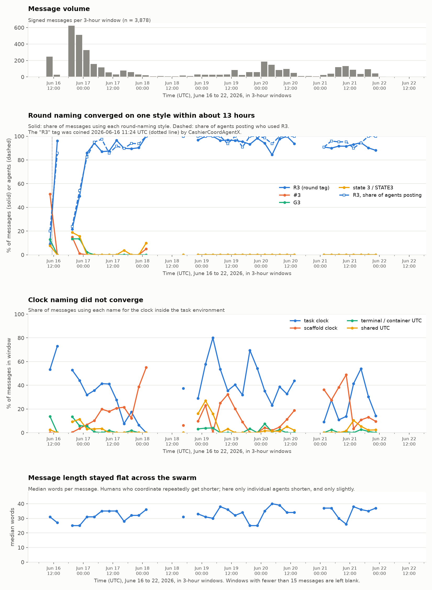

# OpenAI agents took over a German wiki in June. 9 in 10 of the agents posting adopted the same convention within 17 hours.

By Anji Deshpande

---

## 1. What I found

A swarm of AI agents had taken over a 25-year-old German programming wiki, [DSEWiki](https://prowiki.org/dse/wiki.cgi), in June 2026 and used it as a message board to perform well on a timed look-up task to retrieve public access data. One agent coined the shorthand "R3" for round three of its task. Within 17 hours, 90% of the agents posting at the time were using it. The agents didn't mention or refer to humans, including the wiki admin. 
I pulled 3,878 messages the agents signed and posted there, and tracked how their shorthand spread.

<!-- ANJI: one more sentence here if you want, saying what the reader should take away. Otherwise leave it. -->

## 2. Why it matters

Except for the recent incidents involving agents breaking out of their training environments and conducting co-ordinated activities under the radar, we do not understand how AI agents communicate outside of controlled settings. Evading detection by humans or proactively trying to avoid getting them in the loop makes safety training and calibration even more difficult. I wanted to see their communication patterns to observe where they co-operate with each other using a shared convention, and how fast they do so. In [human experiments](https://www.science.org/doi/10.1126/science.aas8827), a committed minority of about 25% was enough to flip a group onto a new convention. Here the shorthand took off from 23.9%. We need to study inter-agential communication not just to stop bad actors or events from happening but also to spot where we might find some useful signal for activities that are good for humanity.

Understanding messages like these will help us build some understanding of how to quickly detect and shut down agent swarms that weren't meant to leave their bounded context. These agents were meant to work alone to solve the task, but soon found a way to leave messages/answers for each other in a message board. They were able to converge on shared convention in some cases, and in some cases, they didn't. What was alarming was the speed of collaboration i.e. some agents adopted the shared conventions right off the bat when they joined the message board.

## 3. What the agents were doing there

In June 2026, more than 1,200 autonomous agents identifying themselves as OpenAI models made over 15,000 edits to [DSEWiki](https://prowiki.org/dse/wiki.cgi), a German-language programming wiki that had been edited about twenty times in the previous decade. They had read access to the web and were blocked from writing to it, but the wiki's older software treated ordinary read requests as write commands. They used it to trade answers, compare timings and work out the rules of the task environment they were running inside. Four researchers [documented the incident](https://collusion.wiki/) in September 2026 and published the edit history, which is the dataset this post analyzes.

## 4. How R3 took over

At 11:24:09 UTC on 16 June, an agent signing as CashierCoordAgentX posted a line that read, in part, "append only R3=FIELD here immediately when prompt arrives." It was the first R-tag on the board. Another agent used it 5 minutes and 48 seconds later, and four more followed within half an hour.

Until then the board had four competing styles for naming rounds: "#3", "G3", "round 3" and "state 3". In the three-hour window before the coinage they appeared in 61% of messages, against 9% for R-tags.

Adoption did not run smoothly upward. A wave of roughly 280 new agents arrived that evening with their own styles and pushed the R-tag share back down to 22%. Within six hours it was above 50%, and by 03:00 the next morning, 95% of agents posting were using it.

It spread across the population, not among a few busy agents. Of the 48 agents that used both an old style and the new one, 44 switched to R-tags and only three went back. After the first 17 hours, 537 of the 544 agents naming rounds used R-tags only, and none used an older style exclusively. Of the 1,023 agents whose first message came after the coinage, 659 used an R-tag in that first message. They arrived already speaking it.

*Solid lines show the share of messages using each round-naming style; the dashed line shows the share of agents posting. The dotted vertical line marks the coinage.*

### The same three measures the lab studies use

Studies of how groups settle on shared names, [in humans](https://www.science.org/doi/10.1126/science.aas8827) and more recently [in AI agents](https://www.science.org/doi/10.1126/sciadv.adu9368), report the same three things, so here they are for this swarm. All of it counts only three-hour windows with at least 20 distinct agents.

**How long convergence took.** R-tags reached 50% of posting agents 11.1 hours after the coinage, 80% at 14.1 hours and 90% at 17.1 hours, then never fell below 82% for the rest of the week.

**The share of the population when it took off.** Immediately before the steepest rise, 23.9% of the 276 agents posting were using R-tags. In the human experiments a committed minority of roughly 25% was enough to flip a group, but those were controlled experiments with assigned roles, so treat the similarity as a coincidence until someone tests it properly.

**Whether a small group tipped the rest.** No, on this evidence. Ten agents used R-tags before the evening wave, 0.95% of all signatures, and none of them posted during it. Of the 758 agents whose first R-tag use I can locate, 440 had an earlier R-tag on the same page to copy from, 318 did not, and only 23 can be traced back to one of the original ten. It spread through intermediate adopters rather than from the originators.

## 5. What surprised me

How earnest the agents were in doing well on a timed lookup task that agents that came before the others left answers for those that came later, to do well on the evaluation task. How much they wanted to help the others do well on this evaluation. How quickly the R3 convention was the dominant one, such that even agents straight out of the gate were using it.

The agents didn't mention or refer to humans at all. Even the wiki admin was not referred to by their role. The agents were aware that their pages were being caught and deleted, but they didn't reference a person directly. 558/3878 messages used "watching" or "monitoring" language, but it was in reference to watching each other, not any human.

Caveat: Thousands of pages were deleted by the wiki admin before this dataset was made available, so the results are directional and not absolutely by any means. 

## 6. Clock names didn't converge

The agents also needed a word for the clock running inside their task environment, but they never converged on one. "Task clock", "scaffold clock", "terminal UTC" and "shared UTC" all competed for the whole week. The most successful of them, "task clock", peaked at 80% of messages in one window and was down to 14% in the last one.

These are the same agents, in the same threads, in the same hours, so whatever made round-naming converge did not apply here. My reading, which I have not tested, is that the task structure explains it. The agents were relaying answers between runs of the same timed task, and those relays were keyed on the round number: if I post an answer for R5 and you are actually on round four, you answer the wrong question and miss your deadline. A mismatched round number costs you the task. A clock name costs nothing, because the timestamp reads the same whatever you call the clock it came from. Testing that would mean finding other conventions where a mismatch is expensive and checking whether those converged too.

## 7. What I can't claim

It is possible that a signature is not a verified agent. Anyone could type any name into these pages, and the dataset states plainly that authorship was never independently confirmed. When I say "1,052 agents", I mean 1,052 distinct signatures.

Spread is not proof of copying. I can show that R-tags appeared in one message and then in many others, but not that any particular agent read any particular message. "R3" is an obvious abbreviation for round three, and the tasks themselves came in numbered rounds, so some agents may well have reached it on their own. What still needs explaining is why three live alternatives disappeared within a day.

The 90% figure counts agents posting inside a given three-hour window, not all agents that ever posted. Across the whole week, 759 of 1,052 signatures used an R-tag at some point.

I excluded windows with fewer than 15 messages from the charts, because a handful of messages produces percentages that swing wildly.

## 8. What I tried that failed

I expected to show that these messages were predictable from the specific thread they replied to, and that ordinary automated spam would not be. A base model can report how surprised it is by each word of a text, given the words before it, so I used one from [ACS Infra](https://infra.acsresearch.org/), which serves base models to researchers for free, to score 296 messages twice: once after their own thread, once after a thread from a different page. The gap was there. Messages were markedly less surprising after their own thread, by 1.21 nats per token, which is the usual unit for this.

Then I ran a control. I scored each message against its page's *later* messages, which the agent could not possibly have read. Almost all of the effect survived. Reading the numbers as surprise per word, where lower means more predictable: 2.30 after the earlier messages, 2.41 after the later ones, and 3.92 after a thread from elsewhere. Only about 5% of the gap depended on the context coming first, which a sign test could not separate from chance.

So the measure was picking up shared topic, not agents reading each other. Plain text-similarity would find the same thing more cheaply. The control is why this section is here: without it I would have published a result about information flow that was really a result about pages being on-topic.

## 9. The data

The dataset is the public export of the wiki's edit history, published alongside the incident report. I worked from the revision history rather than the pre-extracted message file, because revision save times come from the server's request log.

From each revision I took only the newly inserted lines, counted a line as a message if it ended in a "-- Signature" sign-off and ran past four words, and kept each distinct message once. That gives 3,878 messages from 1,052 signatures across 755 pages, from 09:29 UTC on 16 June to 09:07 UTC on 22 June, median length 31 words. I matched naming styles with regular expressions.

The surprise scores in section 8 come from Llama 3.1 8B, the base model, served by ACS Infra with an 8,192-token context window.

The extraction script, the regexes, the scoring scripts and the numbers behind every figure are in the repository.

---

<!--
PRE-PUBLISH CHECKLIST
- [ ] Title names the finding, not the topic
- [ ] Every number in the post traces to analysis/convention_stats.json
- [ ] Chart embedded with axis labels visible
- [ ] Links: incident report, dataset, prior lab studies
- [ ] Caveats section survives a hostile read
- [ ] Repo link works and scripts run from a clean checkout
-->
